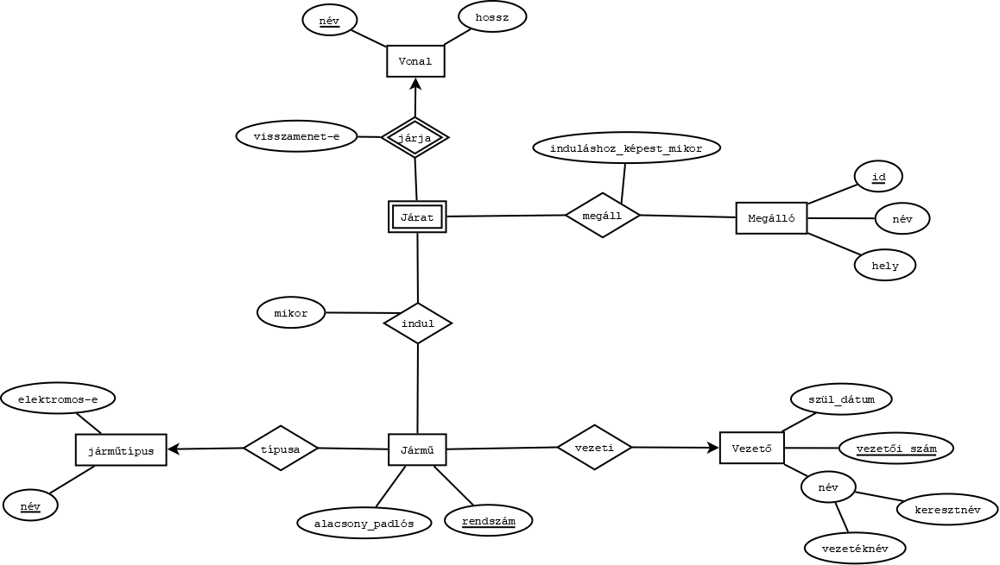

# Városi tömegközelekdés Projekt
## Adatbázisok 2020. Löffler Levente

---

### 1. **Ismertető**
Az adatbázis egy város tömegközlekedését reprezentálja.
A felhasználók indulási és érkezési állomások szerint információt szerezhetnek különböző járatokról.
Ezen információk közé tartoznak pl.: indulás ideje, érkezés ideje, jármű típusa, mozgáskorlátozottsága felkészültség, vonal hossza.

Az adatbázist egy alkalmazáson keresztül lehet elérni. Ez rendelkezik megfelelő grafikus felülettel a fentebb említett adatok böngészésére.
Van továbbá lehetőség regisztrációra, a regisztrált felhasználók további információkat is megtekinthetnek pl.: vezető neve, jármű rendszáma.
A megfelelő beosztású dolgozók adminisztrátori jogosultsággal rendelkező fiókot kapnak, ami az adatbázis módosítására is lehetőséget ad.

### 2. **Felhasznált eszközök**
TBD

### 3. **Az adatbázis egyed-kapcsolat diagramja**

### 4. **Az diagram sémákká való leképezésének folyamata**
Jelölések: a sémák kulcsait **félkövéren**, a külső kulcsokat pedig *dőlten* jelölöm.

A diagramon látható egyedek a következőek: Vezető, Jármű, Járműtípus, Járat, Vonal, Megálló.
- Egy jármű jelképez egy konkrét, rendszámmal ellátott fizikai járművet.
- A járműtípusok diktálják a járművek típusának értéktartományát.
- A vonal jelképezi az útvonalat, amelyen a járművek járnak.
- A járat reprezentálja a járművek összességét, amelyek az adott vonalon járnak.
- A megálló egy fizikai megállóhely.

A vezető, a jármű, a vonal, és a megálló egyértelműen leképezhetőek sémákká:  
- Vezető(**vezetői_szám**, vezetéknév, keresztnév, szül_dátum)
- Jármű(**rendszám**, alacsony_padlós)
- Járműtípus(**név**, elektromos)
- Vonal(**név**, hossz)
- Megálló(**id**, név, hely)

A járat egy gyenge egyed. Egy járat csak egy vonalon megy, illetve egy vonalon 2 féle járat jár: egy a vonal A végállomásából a B-be, és egy visszafelé.
Így egy járatot azonosíthatunk az alapján, hogy melyik vonalon, milyen irányba megy. A vonal neve külső kulcs lesz:  
- Járat(***vonal_név***, **visszamenet**)

Jöjjenek a kapcsolatok. Ezek a következőek: a vezetők vezetik a járműveket, a járművek felvesznek egy típust maguknak és elindulnak járatként bizonyos időpontokban, a járatok pedig megállnak megállóknál bizonyos időpontokban.  
- Vezeti(***vezetői_szám***, ***rendszám***)
- Indul(***rendszám***, ***vonal_név***, ***visszamenet***, mikor)
- Megáll(***vonal_név***, ***visszamenet***, ***megálló_id***, induláshoz_képest_mikor)
- Típusa(***rendszám***, ***típus_név***)

Ezek után végezhetünk összevonást a Vezeti és Típusa 1:N kapcsolatokon:
- Jármű(**rendszám**, alacsony_padlós, *típus_név*, *vezetői_szám*)

Ezzel a teljes egyed-kapcsolat diagram le van képezve sémákká. A végleges sémák:
- Vezető(**vezetői_szám**, vezetéknév, keresztnév, szül_dátum)
- Járműtípus(**név**, elektromos)
- Jármű(**rendszám**, alacsony_padlós, *típus_név*, *vezetői_szám*)
- Vonal(**név**, hossz)
- Megálló(**id**, név, hely)
- Járat(***vonal_név***, **visszamenet**)
- Indul(***rendszám***, ***vonal_név***, ***visszamenet***, mikor)
- Megáll(***vonal_név***, ***visszamenet***, ***megálló_id***, induláshoz_képest_mikor)

### 5. **A sémák normalizálása**
#### 1NF
A sémák már 1. normálformában vannak, hiszen nincs többértékű attribútum, az összetett attribútumokat pedig eleve részeikre bontva képeztem le a sémákban.

#### 2NF
Az egyedek sémái (a járatot leszámítva) mind egyelemű kulcsokkal rendelkeznek, így azok 2. normálformában vannak. A járatnak nincsenek más attribútumai a kulcsain kívül, így az is.  
Az Indul mikor attribútuma teljesen függ a kulcstól, hiszen más rendszámú, más vonalon induló, más irányú járművek indulási időpontjai sem összefüggőek. Végezetül a Megáll induláshoz_képest_mikor attribútuma is teljesen függ a séma kulcsától, hiszen más vonanalon közlekedő járművek más megállóknál állnak meg, a vonal iránya pedig befolyásolja, hogy az adott megállóhoz induláshoz képest hányadik percben ér. Így tehát az összes séma megfelel a 2. normálformának.

#### 3NF
Több másodlagos attribútummal csak a Vezető, Jármű, és Megálló sémák rendelkeznek. A vezető esetében a neve és a születési dátuma között semmilyen összefüggés nincs. Ugyanez igaz a jármű típusára, padlószintjére, és vezetői számára. Egy megálló neve és helyszíne között sincsen kapcsolat. Ezek így 3. normálformában vannak, ahogy a Járműtípus, Járat, Indul, Vonal, és Megáll sémák is, hiszen azokban
nincs egynél több másodlagos attribútum, így nincs amik közt függés alakulhatna ki.
